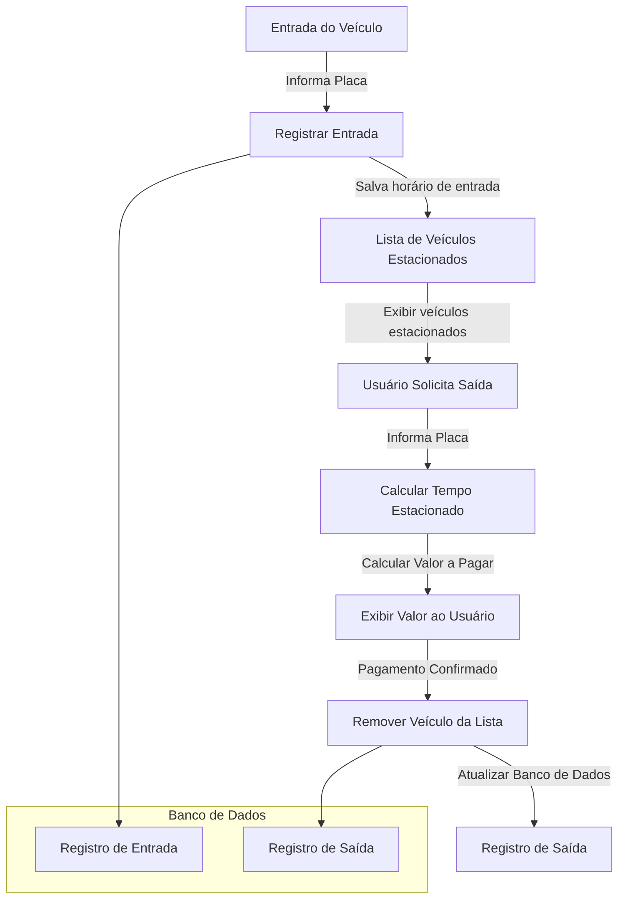

# API-Estacionamento
Calculo

```mermaid
graph TD;
    A[Entrada do Veículo] -->|Informa Placa| B[Registrar Entrada]
    B -->|Salva horário de entrada| C[Lista de Veículos Estacionados]
    C -->|Exibir veículos estacionados| D[Usuário Solicita Saída]
    D -->|Informa Placa| E[Calcular Tempo Estacionado]
    E -->|Calcular Valor a Pagar| F[Exibir Valor ao Usuário]
    F -->|Pagamento Confirmado| G[Remover Veículo da Lista]
    G -->|Atualizar Banco de Dados| H[Registro de Saída]

    subgraph Banco de Dados
        I[Registro de Entrada]
        J[Registro de Saída]
    end

    B --> I
    G --> J

```
