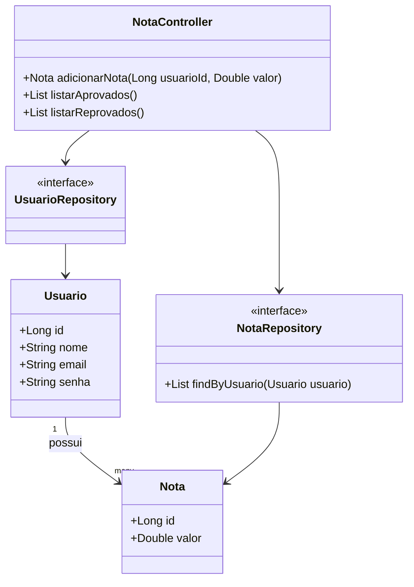

# API-Calculo-de-notas-
Calculo

```mermaid
classDiagram
    class Usuario {
        +Long id
        +String nome
        +String email
        +String senha
    }

    class Nota {
        +Long id
        +Double valor
    }

    class UsuarioRepository {
        <<interface>>
    }

    class NotaRepository {
        <<interface>>
        +List<Nota> findByUsuario(Usuario usuario)
    }

    class NotaController {
        +Nota adicionarNota(Long usuarioId, Double valor)
        +List<Usuario> listarAprovados()
        +List<Usuario> listarReprovados()
    }

    Usuario "1" --> "many" Nota : possui
    UsuarioRepository --> Usuario
    NotaRepository --> Nota
    NotaController --> NotaRepository
    NotaController --> UsuarioRepository
```
